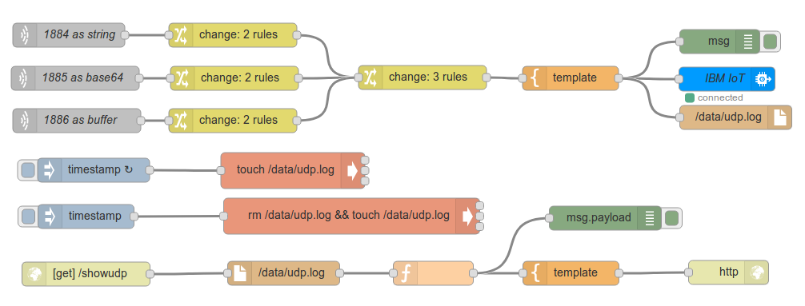

# NB-IOT relay to WIOTP
## Basic UDP to Watson IOT relay using Node-RED container

A starter kit to enable UDP datagrams published from NB-IOT sensors to be bridged into the [Watson IOT Platform](https://www.ibm.com/uk-en/marketplace/internet-of-things-cloud).

This demo makes use of the following IBM Cloud services:
+ Container image repository
+ Container service to run a [docker](http://docker.com) image
+ Watson IOT Platform - Quickstart

and a [docker build of Node-RED](https://nodered.org/docs/platforms/docker).

The process accepts messages on 3  UDP ports:
. 1884  returns a string
. 1885  returns a Base64-encoded string
. 1886  returns a Buffer

Basic setup requirements are derived from the [tutorial](https://console.bluemix.net/docs/containers/cs_tutorials_cf.html#cf_tutorial), with adjustments as needed to build the application using [node-RED](https://nodered.org).
