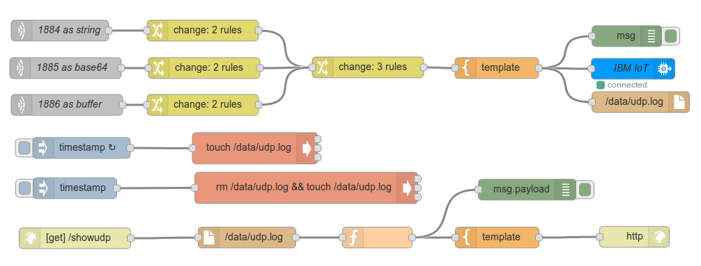
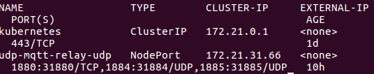
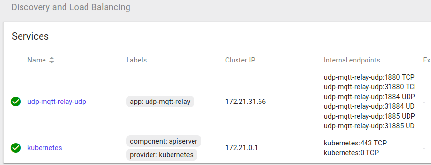
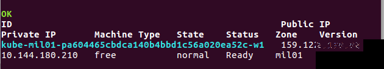
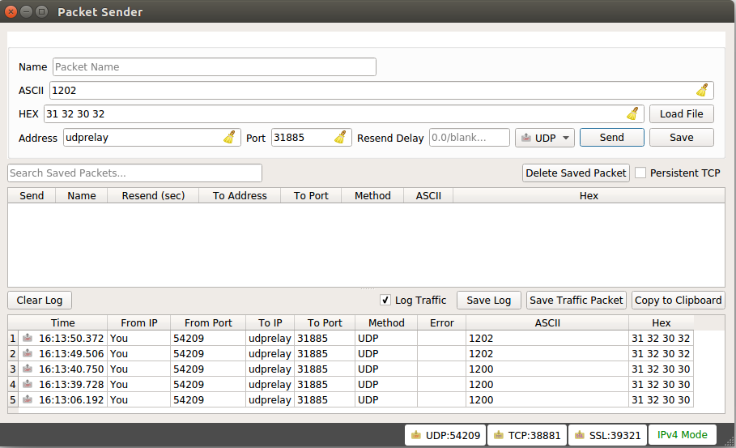
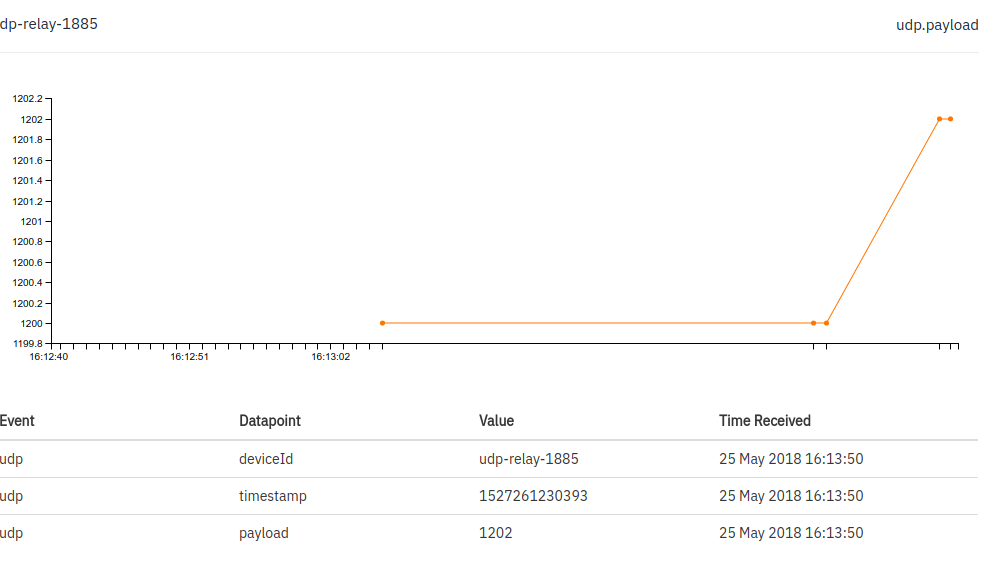

# Set up the cloud container environment - Kubernetes
To get started with IBM Cloud Containers Service, [install Bluemix Command line tool](https://console.bluemix.net/docs/cli/reference/bluemix_cli/get_started.html#getting-started)

Add the containers service plugin to the CLI

`bx plugin install container-registry -r Bluemix`

Login to IBM Cloud

`bx login`

Create a namespace for holding images

`bx cr namespace-add <my_namespace>`

`bx cr namespace-list`

Create a free cluster

`bx cs locations`

`bx cs cluster-create --name <my_cluster>`

(this takes a few minutes - 2-10 minutes)

# Set up the local container environment - Docker
Install [docker tools for your Operating System](https://www.docker.com/community-edition#/download)

Create [Dockerfile](/docker)

Create node-RED flow file [flows.json](/flows.json)

Build and run local docker image

`docker build -t udprelay:latest .`

`docker run -it -p 1880:8880 udprelay:latest`

View node-RED IDE with browser [docker-ip:8880](http://172.17.0.2:8880)

# Deploy application to the cloud

Create and save image to the IBM Cloud registry

`bx cr build -t registry.eu-gb.bluemix.net/<my_namespace>/nrudpmqtt:latest .`

Set environment to enable Kubernetes tools to comminucate with IBM Container service

`bx cs cluster-config <my_cluster>`

The output from this command will show the instruction for exporting *KUBECONFIG* environment

`export KUBECONFIG=/home/(...).yaml`

Create an instance of the application image, and define the service ports to make it accessible on the public IP address

`kubectl apply -f udp-mqtt-relay.yaml`

Run a command to review the status of the deployed application instance
`kubectl get svc`

This will show the ports registered for the application

This can also be seen in the Kubernetes dashboard, launched from the IBM Cloud console containers view:

Run a command to list the public IP address of the cluster service

`bx cs workers <cluster_name>`

Note the external IP address:

# Test the udp to mqtt relay

Add the external IP address to your local `/etc/hosts` file

`sudo echo *ipaddress* udprelay > /etc/hosts`

If you don't have your own UDP client to generate test packets, check out [Packet Sender](https://packetsender.com/download)

if you have [*netcat*](https://www.sans.org/security-resources/sec560/netcat_cheat_sheet_v1.pdf) installed, you can generate traffic interactively or with a script

`nc -u udprelay 31884`

Type in message data; netcat will send each time you press return. Hit `CTrl-C` to finish

and the results in Quickstart

